# MIT Beer Game - Complete System Analysis & Documentation

**Generated:** 2025-11-23
**Purpose:** Comprehensive analysis of the MIT Beer Game implementation, including architecture, parameters, data flow, and implementation details.

---

## Table of Contents

1. [Executive Summary](#executive-summary)
2. [System Architecture Overview](#system-architecture-overview)
3. [Simple System Flowchart](#simple-system-flowchart)
4. [Detailed System Flowchart](#detailed-system-flowchart)
5. [Module Breakdown](#module-breakdown)
6. [Parameter Analysis](#parameter-analysis)
7. [Data Flow & Logging](#data-flow--logging)
8. [Feature Implementation Matrix](#feature-implementation-matrix)
9. [LLM Integration](#llm-integration)
10. [File Dependencies](#file-dependencies)

---

## 1. Executive Summary

The MIT Beer Game is a sophisticated multi-agent simulation framework that uses Large Language Models (LLMs) to simulate strategic behavior in a four-tier supply chain (Retailer → Wholesaler → Distributor → Factory). The system supports:

- **LLM-driven decision making** via OpenAI/Anthropic APIs
- **Agent memory systems** for learning from past rounds
- **Inter-agent communication** for coordination
- **Chain-level orchestration** with optional override
- **Comprehensive logging** in CSV, JSON, and human-readable formats
- **Real-time visualization** with matplotlib
- **Cost tracking** for LLM API usage

**Key Innovation**: Each agent is an autonomous LLM that learns, communicates, and adapts its ordering strategy to maximize profit while managing inventory and backlog costs.

---

## 2. System Architecture Overview

### Core Components

```
┌──────────────────────────────────────────────────────────────┐
│                    MIT Beer Game System                       │
├──────────────────────────────────────────────────────────────┤
│                                                                │
│  ┌────────────────┐  ┌────────────────┐  ┌────────────────┐ │
│  │ executeMITBeer │  │ MIT_Beer_Game  │  │ models_mitb    │ │
│  │ Game.py        │──│ .py            │──│ _game.py       │ │
│  │ (CLI Entry)    │  │ (Orchestrator) │  │ (Agents)       │ │
│  └────────────────┘  └────────────────┘  └────────────────┘ │
│                                                                │
│  ┌────────────────┐  ┌────────────────┐  ┌────────────────┐ │
│  │ prompts_mitb   │  │ llm_calls_mitb │  │ memory_storage │ │
│  │ _game.py       │  │ _game.py       │  │ .py            │ │
│  │ (Prompt Eng)   │  │ (LLM API)      │  │ (Memory Mgmt)  │ │
│  └────────────────┘  └────────────────┘  └────────────────┘ │
│                                                                │
│  ┌────────────────┐  ┌────────────────┐  ┌────────────────┐ │
│  │ analysis_mitb  │  │ orchestrator   │  │ langraph       │ │
│  │ _game.py       │  │ _mitb_game.py  │  │ _workflow.py   │ │
│  │ (Visualization)│  │ (Orchestrator) │  │ (Workflow)     │ │
│  └────────────────┘  └────────────────┘  └────────────────┘ │
│                                                                │
└──────────────────────────────────────────────────────────────┘
```

### Module Responsibilities

| Module | Primary Responsibility | Key Classes/Functions |
|--------|----------------------|---------------------|
| `executeMITBeerGame.py` | CLI entry point, argument parsing | `parse_args()`, `main()` |
| `MIT_Beer_Game.py` | Main simulation orchestrator, game loop | `run_beer_game_simulation()`, `run_beer_game_generation()` |
| `models_mitb_game.py` | Agent behavior, data models | `BeerGameAgent`, `RoundData`, `SimulationData` |
| `prompts_mitb_game.py` | LLM prompt engineering | `BeerGamePrompts`, `PromptEngine`, `AgentContext` |
| `llm_calls_mitb_game.py` | LLM API integration | `LiteLLMClient`, `AnthropicLLMClient` |
| `memory_storage.py` | Memory management | `AgentMemory`, `SharedMemory`, `MemoryManager` |
| `analysis_mitb_game.py` | Visualization & analysis | `plot_beer_game_results()`, `calculate_nash_deviation()` |
| `orchestrator_mitb_game.py` | Chain-level orchestrator | `BeerGameOrchestrator` |
| `langraph_workflow.py` | Workflow coordination | `BeerGameWorkflow` |
| `cost_logger_mitb_game.py` | LLM cost tracking | `start_run()`, `add_cost()`, `end_run()` |

---

## 3. Simple System Flowchart

```mermaid
flowchart TD
    Start([Start Simulation]) --> Init[Initialize Agents]
    Init --> Strat[Agents Initialize Strategies]
    Strat --> RoundLoop{For Each Round}

    RoundLoop --> Receive[Receive Shipments]
    Receive --> Ship[Process Shipments & Fulfill Orders]
    Ship --> Costs[Calculate Costs & Update Balance]

    Costs --> Comm{Communication<br/>Enabled?}
    Comm -->|Yes| CommPhase[Agent Communication Phase]
    Comm -->|No| Orch
    CommPhase --> Orch

    Orch{Orchestrator<br/>Enabled?}
    Orch -->|Yes| OrchRec[Generate Orchestrator Recommendations]
    Orch -->|No| Decision
    OrchRec --> Decision

    Decision[Agents Make Order Decisions]
    Decision --> Override{Orchestrator<br/>Override?}
    Override -->|Yes| UseOrch[Use Orchestrator Orders]
    Override -->|No| UseAgent[Use Agent Decisions]

    UseOrch --> Place
    UseAgent --> Place[Place Orders Upstream]

    Place --> Costs2[Deduct Purchase/Production Costs]
    Costs2 --> Bankrupt{Any Agent<br/>Bankrupt?}
    Bankrupt -->|Yes| End
    Bankrupt -->|No| Log

    Log[Log Round Data]
    Log --> Plot[Generate Plots]
    Plot --> Memory{Memory<br/>Enabled?}
    Memory -->|Yes| UpdateMem[Update Agent Memories]
    Memory -->|No| CheckRounds
    UpdateMem --> CheckRounds

    CheckRounds{More<br/>Rounds?}
    CheckRounds -->|Yes| RoundLoop
    CheckRounds -->|No| Final

    Final[Final Analysis & Visualization]
    Final --> Save[Save Results & Metrics]
    Save --> End([End Simulation])

    style Start fill:#90EE90
    style End fill:#FFB6C1
    style Decision fill:#87CEEB
    style CommPhase fill:#DDA0DD
    style OrchRec fill:#F0E68C
    style Bankrupt fill:#FF6347
```



---

## 4. Detailed System Flowchart

```mermaid
flowchart TD
    Start([executeMITBeerGame.py<br/>User runs simulation]) --> ParseArgs[parse_args Function<br/>Parses CLI arguments:<br/>--num_rounds, --temperature<br/>--enable_communication, etc.]

    ParseArgs --> SelectProvider{Provider<br/>Selection}
    SelectProvider -->|litellm| LiteLLM[llm_calls_mitb_game.py<br/>Initialize LiteLLMClient<br/>Configure OpenAI endpoint]
    SelectProvider -->|anthropic| Anthropic[llm_calls_mitb_game.py<br/>Initialize AnthropicLLMClient<br/>Configure Claude endpoint]

    LiteLLM --> RunSim
    Anthropic --> RunSim

    RunSim[MIT_Beer_Game.py<br/>run_beer_game_simulation]
    RunSim --> CreateFolder[Create Results Folder<br/>simulation_results/run_N_YYYY-MM-DD_HH-MM-SS]

    CreateFolder --> OpenLog[Open human_readable_log.txt<br/>Write simulation parameters]
    OpenLog --> InitAgents[models_mitb_game.py<br/>Create 4 BeerGameAgents:<br/>Retailer, Wholesaler,<br/>Distributor, Factory]

    InitAgents --> InitBalance[Set Initial State:<br/>inventory=initial_inventory<br/>backlog=initial_backlog<br/>balance=initial_balance]

    InitBalance --> InitStrat[Each Agent Calls:<br/>initialize_strategy]
    InitStrat --> LLMInit[prompts_mitb_game.py<br/>get_strategy_generation_prompt<br/>Includes economics & hyperparams]

    LLMInit --> CallLLM1[llm_calls_mitb_game.py<br/>chat_completion<br/>Returns strategy JSON]
    CallLLM1 --> ParseStrat[safe_parse_json<br/>Extract strategy fields]

    ParseStrat --> InitMem{enable_memory?}
    InitMem -->|Yes| CreateMem[memory_storage.py<br/>MemoryManager creates<br/>AgentMemory for each agent<br/>retention_rounds param]
    InitMem -->|No| InitWorkflow

    CreateMem --> SharedMem{enable_shared_memory?}
    SharedMem -->|Yes| CreateShared[Create SharedMemory pool]
    SharedMem -->|No| InitWorkflow
    CreateShared --> InitWorkflow

    InitWorkflow{enable_memory OR<br/>enable_shared_memory?}
    InitWorkflow -->|Yes| LangGraph[langraph_workflow.py<br/>Initialize BeerGameWorkflow<br/>Coordinates memory & communication]
    InitWorkflow -->|No| OrchInit
    LangGraph --> OrchInit

    OrchInit{enable_orchestrator?}
    OrchInit -->|Yes| CreateOrch[orchestrator_mitb_game.py<br/>BeerGameOrchestrator<br/>history_window param]
    OrchInit -->|No| LogInit
    CreateOrch --> LogInit

    LogInit[Log Round 0:<br/>Initial state before any processing]
    LogInit --> RoundLoop

    RoundLoop{Round Loop<br/>for r in range num_rounds}
    RoundLoop --> GenDemand[Generate external_demand r<br/>from normal distribution<br/>μ=10, σ=3, clipped 0-20]

    GenDemand --> ShiftPipeline[Shift Pipelines:<br/>shipments_in_transit 0→arriving, 1→0<br/>orders_in_transit 0→arriving, 1→0]

    ShiftPipeline --> UpdateBacklog[Add arrived orders to backlog:<br/>agent.backlog += orders_in_transit 0]

    UpdateBacklog --> Fulfill[Fulfill Orders:<br/>Retailer: min inventory, external_demand+backlog<br/>Others: min inventory, backlog]

    Fulfill --> Revenue[Calculate Revenue & Costs:<br/>revenue = shipment_sent * sale_price<br/>holding_cost = inventory * h<br/>backlog_cost = backlog * b]

    Revenue --> UpdateBal[Update Balance:<br/>balance += revenue<br/>balance -= holding_cost + backlog_cost<br/>Update profit_history & balance_history]

    UpdateBal --> CommCheck{enable_communication?}
    CommCheck -->|Yes| CommLoop[Communication Phase Loop<br/>for c in range communication_rounds]
    CommCheck -->|No| OrchPhase

    CommLoop --> CommAgent[Each Agent Calls:<br/>generate_communication_message]
    CommAgent --> CommPrompt[prompts_mitb_game.py<br/>get_communication_prompt<br/>Includes recent messages,<br/>agent state, economics]

    CommPrompt --> LLMComm[llm_calls_mitb_game.py<br/>chat_completion<br/>Returns message JSON]
    LLMComm --> StoreMsg[Store message in:<br/>communication_messages list<br/>agent.message_history]

    StoreMsg --> NextComm{More comm<br/>rounds?}
    NextComm -->|Yes| CommLoop
    NextComm -->|No| OrchPhase

    OrchPhase{enable_orchestrator?}
    OrchPhase -->|Yes| OrchCall[orchestrator_mitb_game.py<br/>get_recommendations<br/>Analyzes all agent states<br/>Returns order recommendations]
    OrchPhase -->|No| DecisionPhase

    OrchCall --> OrchPrompt[prompts_mitb_game.py<br/>get_orchestrator_prompt<br/>Chain state, history last N rounds]
    OrchPrompt --> LLMOrch[llm_calls_mitb_game.py<br/>chat_completion<br/>Returns list of role/order pairs]

    LLMOrch --> BroadcastOrch[Broadcast Orchestrator<br/>recommendations as messages<br/>to all agents]
    BroadcastOrch --> DecisionPhase

    DecisionPhase{Workflow exists?}
    DecisionPhase -->|Yes| WorkflowDecision[langraph_workflow.py<br/>workflow.run_round<br/>Coordinates memory retrieval,<br/>communication, decisions]
    DecisionPhase -->|No| DirectDecision

    WorkflowDecision --> WFRetrieve[_retrieve_memory_node:<br/>Load memory_context for each agent]
    WFRetrieve --> WFComm[_communication_phase_node:<br/>Already done above if enabled]
    WFComm --> WFDecision[_decision_making_node:<br/>Parallel llm_decision calls]
    WFDecision --> WFProcess[_process_orders_node:<br/>Update inventory, backlog, profits]
    WFProcess --> WFUpdate[_update_memory_node:<br/>Store new memories]
    WFUpdate --> ExtractDecisions

    DirectDecision[Each Agent Calls:<br/>llm_decision phase=decision]
    DirectDecision --> BuildContext[prompts_mitb_game.py<br/>PromptEngine.build_prompt<br/>Creates AgentContext with:<br/>inventory, backlog, demand,<br/>shipments, profit_history,<br/>balance_history, economics,<br/>hyperparameters]

    BuildContext --> InjectMem{agent.memory?}
    InjectMem -->|Yes| MemContext[Inject memory_context<br/>from past N rounds]
    InjectMem -->|No| InjectComm
    MemContext --> InjectComm

    InjectComm{recent_communications?}
    InjectComm -->|Yes| CommContext[Inject communication messages<br/>from this round]
    InjectComm -->|No| InjectOrch
    CommContext --> InjectOrch

    InjectOrch{orchestrator_advice?}
    InjectOrch -->|Yes| OrchContext[Inject orchestrator rationale]
    InjectOrch -->|No| FinalPrompt
    OrchContext --> FinalPrompt

    FinalPrompt[prompts_mitb_game.py<br/>get_decision_prompt<br/>With controller equations:<br/>μ, IP, S*, BacklogClear,<br/>O_raw, O_final, solvency check]

    FinalPrompt --> LLMDecision[llm_calls_mitb_game.py<br/>chat_completion<br/>Temperature, agent_role, decision_type]

    LLMDecision --> TrackCost[Track LLM costs:<br/>prompt_tokens, completion_tokens<br/>cost from headers or calculated<br/>Update total_calls, total_cost]

    TrackCost --> SaveMetrics[Save to:<br/>llm_inference_metrics.json<br/>cost_logger_mitb_game.py:<br/>add_cost run_id, cost]

    SaveMetrics --> ParseDecision[safe_parse_json<br/>Extract order_quantity,<br/>confidence, rationale, calc fields]

    ParseDecision --> LogLLM[log_llm_call_immediately<br/>Write to human_readable_log.txt:<br/>system prompt, user prompt,<br/>model output]

    LogLLM --> ExtractDecisions

    ExtractDecisions[Extract order_quantity<br/>from each agent's decision]
    ExtractDecisions --> OverrideCheck{orchestrator_override<br/>AND orchestrator_recs?}

    OverrideCheck -->|Yes| UseOrchOrder[order_qty = orchestrator_recs<br/>role_name order_quantity]
    OverrideCheck -->|No| UseAgentOrder[order_qty = decision<br/>order_quantity]

    UseOrchOrder --> QueueOrders
    UseAgentOrder --> QueueOrders

    QueueOrders[Queue orders to upstream:<br/>upstream_agent.orders_in_transit 1<br/>+= order_qty]

    QueueOrders --> DeductCost[Deduct Purchase/Production Cost:<br/>Factory: production_cost * qty<br/>Others: purchase_cost * qty<br/>balance -= cost]

    DeductCost --> BankruptCheck{Any agent<br/>balance <= 0?}
    BankruptCheck -->|Yes| EndSim[Log bankruptcy<br/>Break round loop]
    BankruptCheck -->|No| LogRound

    LogRound[Create RoundData for each agent:<br/>generation, round_index, role_name,<br/>inventory, backlog, order_placed,<br/>order_received, shipment_received,<br/>shipment_sent_downstream,<br/>starting_balance, revenue,<br/>purchase_cost, holding_cost,<br/>backlog_cost, ending_balance,<br/>orchestrator_order, orchestrator_rationale,<br/>orders_in_transit_0/1,<br/>production_queue_0/1,<br/>LLM snapshot fields]

    LogRound --> AddToSim[sim_data.add_round_entry<br/>sim_data.add_communication_entry<br/>sim_data.add_aggregated_round]

    AddToSim --> WriteCSV[Write Complete CSV:<br/>beer_game_detailed_log.csv<br/>All rounds up to current<br/>with external_demand, profit_accumulated]

    WriteCSV --> WriteJSON[Write Complete JSON:<br/>beer_game_detailed_log.json<br/>Nested structure:<br/>hyperparameters, rounds_log,<br/>flat_rounds_log, communication_log]

    WriteJSON --> PlotRound[analysis_mitb_game.py<br/>plot_beer_game_results<br/>Generate 6-7 subplots:<br/>Inventory, Backlog, Balance,<br/>Orders, Shipments, Orchestrator,<br/>External Demand]

    PlotRound --> WritePlots[Save plots:<br/>inventory_over_time.png<br/>backlog_over_time.png<br/>balance_over_time.png<br/>orders_over_time.png<br/>shipments_over_time.png<br/>combined_plots.png]

    WritePlots --> UpdateMem2{enable_memory?}
    UpdateMem2 -->|Yes| StoreMem[Each agent.update_memory:<br/>decision_memory, communication_memory,<br/>performance_memory<br/>Enforce retention policy]
    UpdateMem2 -->|No| NextRound

    StoreMem --> SharedUpdate{enable_shared_memory?}
    SharedUpdate -->|Yes| UpdateShared[shared_memory.add_market_observation:<br/>total_inventory, total_backlog,<br/>total_orders, external_demand]
    SharedUpdate -->|No| NextRound
    UpdateShared --> NextRound

    NextRound{round < num_rounds?}
    NextRound -->|Yes| RoundLoop
    NextRound -->|No| FinalAnalysis

    FinalAnalysis[Calculate Nash Deviation:<br/>analysis_mitb_game.py<br/>calculate_nash_deviation<br/>Compare order_placed to equilibrium]

    FinalAnalysis --> SessionSummary[llm_calls_mitb_game.py<br/>get_session_summary<br/>total_calls, total_cost,<br/>total_tokens, avg_time]

    SessionSummary --> WriteSummary[Save:<br/>llm_session_summary.json<br/>Move llm_inference_metrics.json<br/>to results folder]

    WriteSummary --> CloseLog[Close human_readable_log.txt<br/>logger.close]

    CloseLog --> ReturnData[Return SimulationData object]
    ReturnData --> EndSim

    EndSim([End Simulation])

    style Start fill:#90EE90
    style EndSim fill:#FFB6C1
    style LLMInit fill:#FFE4B5
    style LLMComm fill:#FFE4B5
    style LLMDecision fill:#FFE4B5
    style LLMOrch fill:#FFE4B5
    style TrackCost fill:#FFA07A
    style BankruptCheck fill:#FF6347
    style WritePlots fill:#87CEEB
    style StoreMem fill:#DDA0DD
```



---

## 5. Module Breakdown

### 5.1 executeMITBeerGame.py

**Purpose:** Command-line interface for running simulations

**Key Functions:**
- `parse_args()`: Parses 30+ CLI arguments
- `main()`: Entry point, selects LLM provider, runs simulation

**Parameters Accepted:**
```python
--num_rounds: int = 10
--temperature: float = 0.0
--model_name: str = "gpt-4o-mini"
--provider: str = "litellm" | "anthropic"
--anthropic_model: str = "claude-3-5-sonnet-latest"
--enable_communication: bool
--communication_rounds: int = 2
--enable_memory: bool
--memory_retention_rounds: int = 5
--enable_shared_memory: bool
--langsmith_project: str = "MIT_beer_game_Langsmith"
--initial_inventory: int = 100
--initial_backlog: int = 0
--sale_price: float = 5.0
--purchase_cost: float = 2.5
--production_cost: float = 1.5
--initial_balance: float = 1000.0
--holding_cost_per_unit: float = 0.0
--backlog_cost_per_unit: float = 2.5
--enable_orchestrator: bool
--orchestrator_history: int = 3
--orchestrator_override: bool
--longtermplanning_boolean: bool
--safety_stock_target: float = 60.0
--backlog_clearance_rate: float = 0.5
--demand_smoothing_factor: float = 0.3
```

---

### 5.2 MIT_Beer_Game.py

**Purpose:** Main simulation orchestrator

**Key Functions:**

1. **`run_beer_game_simulation`** (lines 940-1208)
   - Creates results folder with run number
   - Opens human-readable log file
   - Initializes 4 agents (Retailer, Wholesaler, Distributor, Factory)
   - Generates external demand pattern from normal distribution
   - Calls `run_beer_game_generation`
   - Generates final plots and Nash deviation analysis
   - Saves LLM session summary

2. **`run_beer_game_generation`** (lines 272-928)
   - **Round Loop** (lines 382-928)
     - Shifts shipment & order pipelines (lines 399-421)
     - Adds arrived orders to backlog (lines 429-434)
     - Fulfills orders with shipment constraint (lines 440-528)
     - Calculates revenue & costs (lines 529-554)
     - **Communication Phase** (lines 555-605): Optional multi-round agent communication
     - **Orchestrator Phase** (lines 607-644): Optional chain-level recommendations
     - **Decision Phase** (lines 646-693): Agents make order decisions
       - Uses workflow if memory enabled
       - Otherwise parallel `llm_decision` calls with context injection
     - Applies orchestrator override if enabled (lines 697-702)
     - Queues orders upstream (lines 705-708)
     - Deducts purchase/production costs (lines 710-722)
     - **Bankruptcy check** (lines 723-727): Stops simulation if balance ≤ 0
     - Logs round data (lines 729-778)
     - Writes CSV incrementally (lines 781-813)
     - Writes JSON incrementally (lines 816-874)
     - Generates plots after each round (lines 876-904)
     - Logs human-readable summary (lines 906-927)

**Pipeline Mechanics:**
```python
# Shipments: physical goods
shipments_in_transit[0] = arriving_now
shipments_in_transit[1] = arriving_next_round

# Orders: information flow
orders_in_transit[0] = arriving_now
orders_in_transit[1] = arriving_next_round

# Production (Factory only)
production_queue[0] = completing_now
production_queue[1] = completing_next_round
```

---

### 5.3 models_mitb_game.py

**Purpose:** Agent behavior and data models

**Key Classes:**

1. **`BeerGameAgent`** (lines 93-547)
   - **Attributes:**
     ```python
     role_name: str  # Retailer, Wholesaler, Distributor, Factory
     inventory: int = 100
     backlog: int = 0
     balance: float = 1000.0
     shipments_in_transit: Dict[int,int] = {0:0, 1:0}
     orders_in_transit: Dict[int,int] = {0:0, 1:0}
     production_queue: Dict[int,int] = {0:0, 1:0}  # Factory only
     downstream_orders_history: List[int]
     profit_history: List[float]
     balance_history: List[float]
     strategy: dict
     memory: Optional[AgentMemory]
     message_history: List[Dict]
     ```

   - **Key Methods:**
     - `llm_decision(phase, **kwargs)` (lines 176-264): Unified LLM gateway
       - Builds `AgentContext` with all state
       - Calls `PromptEngine.build_prompt`
       - Gets system prompt
       - Calls LLM via `chat_completion`
       - Logs immediately to human-readable file
       - Returns JSON decision

     - `initialize_strategy(**kwargs)` (lines 269-279): Deprecated wrapper to `llm_decision`

     - `decide_order_quantity(**kwargs)` (lines 285-352): Legacy decision method
       - Still used in non-workflow paths
       - Builds prompts directly via `prompts.get_decision_prompt`

     - `generate_communication_message(**kwargs)` (lines 354-371): Delegates to `llm_decision('communication')`

     - `load_memory_context()` (lines 444-455): Retrieves memory contexts

     - `update_memory(round_number, decision_output, communication_output, performance_data)` (lines 457-500)
       - Stores decision, communication, strategy, performance memories

     - `update_profit_history(round_profit, new_balance)` (lines 502-510)
       - Maintains last 20 rounds of profit & balance

2. **`RoundData`** (lines 11-48)
   - Records all data for one agent in one round
   - 30+ fields including LLM snapshots, pipeline state, financials

3. **`SimulationData`** (lines 50-72)
   - Stores hyperparameters, rounds_log, communication_log, aggregated_rounds

4. **`BeerGameLogger`** (lines 74-92)
   - Simple logger with file output

---

### 5.4 prompts_mitb_game.py

**Purpose:** Prompt engineering and context building

**Key Classes:**

1. **`BeerGamePrompts`** (lines 5-785)

   **Role Specialties** (lines 18-28):
   - Retailer: Faces true market demand, must avoid stock-outs
   - Wholesaler: Intermediary, dampens demand variability
   - Distributor: Bridges Wholesaler-Factory, buffers lead-time
   - Factory: Schedules production with 1-round delay

   **Objective Guidance** (lines 54-86):
   - `longtermplanning_boolean=True`: Collaborative optimization, chain-wide success
   - `longtermplanning_boolean=False`: Individual profit maximization, competitive

   **Prompt Methods:**
   - `get_strategy_generation_prompt` (lines 96-173): Initial strategy with hyperparameters
   - `get_strategy_update_prompt` (lines 175-256): Update based on performance
   - `get_decision_prompt` (lines 258-410): **Core decision prompt**
     - Includes current state, economics, profit/balance history
     - **Mandatory Controller** (lines 357-376):

       $$\mu = \text{EWMA of recent demand}$$

       $$\text{IP} = \text{on\_hand} + \text{in\_transit} - \text{backlog}$$

       $$\text{MinimumBuffer} = 3 \times \mu$$

       $$S^* = \mu \times (\text{lead\_time} + 1) + S_s$$

       $$\text{BacklogClear} = \gamma \times \text{backlog} \quad \text{where } \gamma = 0.8 \text{ if } \frac{\text{backlog}}{S_s} > 0.3$$

       $$O_{\text{raw}} = \max(0, S^* - \text{IP} + \text{BacklogClear})$$

       Smoothing conditional on IP and backlog

       Solvency cap: $(\text{balance} - c \times O_{\text{final}}) > 0$

     - Self-audit booleans: `coverage_ok`, `includes_backlog`, `solvency_ok`

   - `get_communication_prompt` (lines 412-529): Agent communication
     - Must reflect on previous speakers
     - Share inventory, demand patterns, order plans
     - Restrictions: no exact quantities for others, factual only

   - `get_decision_prompt_with_communication` (lines 533-585): Injects communication context

   - `get_memory_context_prompt` (lines 587-611): Formats agent memory

   - `get_system_prompt` (lines 732-785): Role-specific system prompt
     - Describes role specialty, objective, profit formula
     - Logging & analysis details
     - Important profitability notes

2. **`AgentContext`** (lines 788-814)
   - Dataclass container for all context fields
   - Used by PromptEngine

3. **`PromptEngine`** (lines 816-935)
   - `build_prompt(role_name, phase, ctx, ...)` (lines 822-935)
     - Validates economics parameters (p, c, h, b all required)
     - Builds decision or communication prompt
     - Injects market overview, memory, orchestrator advice
     - Adds communication checklist (8 points)

   - `get_orchestrator_prompt` (lines 940-961): Chain-level prompt
     - Recommends orders for all 4 roles
     - Minimizes total backlog & holding costs
     - Ensures minimum buffer ($S_s + 3 \times \mu$)

---

### 5.5 llm_calls_mitb_game.py

**Purpose:** LLM API integration and cost tracking

**Key Classes:**

1. **`LiteLLMClient`** (lines 92-329)
   - **`chat_completion`** (lines 109-284):
     - Builds payload with system/user prompts
     - Rate limiting with asyncio.Semaphore(2)
     - Retry logic for 429 errors (max 5 retries, exponential backoff)
     - Extracts cost from:
       1. Response header `x-litellm-response-cost`
       2. Usage body fields (cost, response_cost, total_cost)
       3. Top-level body fields
       4. Fallback calculation: GPT-4o pricing ($5/1M input, $15/1M output)
     - Updates running totals: `total_calls`, `total_cost`, `total_tokens`, `total_inference_time`
     - Creates comprehensive metrics dict (14 fields)
     - Saves to `llm_inference_metrics.json`
     - Calls `cost_logger_mitb_game.add_cost(run_id, cost)` for cross-run aggregation

   - **`get_session_summary`** (lines 310-329): Returns 8-field summary dict

2. **`AnthropicLLMClient`** (lines 335-416)
   - Similar structure but for Anthropic Claude API
   - Uses `x-api-key` header
   - No token/cost tracking currently (Anthropic doesn't return in standard field)

**Global Variables:**
```python
MODEL_NAME: str = "gpt-4o-mini"  # Default model
lite_client = None  # Overridden by executeMITBeerGame.py
```

**Utility Functions:**
- `safe_parse_json(response_str)` (lines 38-74): Robust JSON extraction with brace balancing
- `parse_json_with_default(response_str, default, context)` (lines 77-89): Salvages order_quantity on parse failure

---

### 5.6 memory_storage.py

**Purpose:** Agent memory management

**Key Classes:**

1. **`MemoryEntry`** (lines 14-27)
   - timestamp, round_number, entry_type, agent_role, data

2. **`AgentMemory`** (lines 30-215)
   - `retention_rounds`: How many past rounds to keep
   - `memories`: List of MemoryEntry

   **Add Methods:**
   - `add_decision_memory` (lines 39-56): order_quantity, inventory, backlog, reasoning, confidence
   - `add_communication_memory` (lines 58-74): message, strategy_hint, collaboration_proposal, information_shared
   - `add_performance_memory` (lines 76-94): profit, inventory, backlog, units_sold, holding_cost, backlog_cost
   - `add_strategy_memory` (lines 96-110): strategy_description, strategy_rationale, expected_outcome

   **Retrieval:**
   - `get_recent_memories(entry_types, max_entries)` (lines 126-139): Filtered & sorted
   - `get_memory_context_for_decision()` (lines 141-171): Formatted text for decision prompts
   - `get_memory_context_for_communication()` (lines 173-193): Formatted text for communication prompts

   **Enforcement:**
   - `_enforce_retention()` (lines 118-124): Removes memories older than retention_rounds

3. **`SharedMemory`** (lines 218-308)
   - `add_shared_insight` (lines 226-241): From any agent
   - `add_market_observation` (lines 243-256): System-level market data
   - `get_shared_context(requesting_agent)` (lines 272-287): Formatted shared insights

4. **`MemoryManager`** (lines 311-432)
   - `create_agent_memory(agent_role)` (lines 330-332): Initialize per-agent memory
   - `get_shared_memory()` (lines 344-346): Access shared pool
   - `save_memories_to_file(filepath)` (lines 354-365): Persist to JSON
   - `load_memories_from_file(filepath)` (lines 367-389): Restore from JSON
   - `get_memory_summary()` (lines 398-431): Statistics on memory usage

---

### 5.7 analysis_mitb_game.py

**Purpose:** Visualization and analysis

**Key Functions:**

1. **`plot_beer_game_results`** (lines 19-292)
   - Creates `global_round` for multi-generation continuity
   - Role styles: distinct linestyle, marker, color for each role
   - Generates 5-7 subplots:
     1. Inventory over time
     2. Backlog over time
     3. Ending balance over time
     4. Order quantity over time
     5. Shipments sent downstream
     6. Orchestrator recommended orders (if enabled)
     7. External demand (if provided)
   - Adds run settings as subtitle (bolds non-default params)
   - Saves:
     - Individual plots: `inventory_over_time.png`, `backlog_over_time.png`, etc.
     - Combined plot: `combined_plots.png`

2. **`calculate_nash_deviation`** (lines 295-308)
   - Computes average absolute deviation from equilibrium order (default 10)
   - Returns dict mapping role → avg deviation

---

### 5.8 orchestrator_mitb_game.py

**Purpose:** Chain-level orchestrator

**Class: `BeerGameOrchestrator`** (lines 9-113)

- `history_window`: Number of past rounds to analyze
- **`get_recommendations`** (lines 35-113):
  - Builds prompt with all agent states
  - Calls LLM with orchestrator system prompt
  - Returns dict mapping `role_name` → `{order_quantity, rationale}`
  - Fallback: 10 units each role on parse failure

---

### 5.9 langraph_workflow.py

**Purpose:** Workflow coordination (optional, used when memory enabled)

**Class: `BeerGameWorkflow`** (lines 51-374)

**Workflow Nodes:**

1. **`_retrieve_memory_node`** (lines 74-92): Loads memory contexts
2. **`_communication_phase_node`** (lines 94-140): Runs agent communication
3. **`_decision_making_node`** (lines 142-195): Parallel agent decisions
4. **`_process_orders_node`** (lines 197-287): Updates inventory, backlog, profits
5. **`_update_memory_node`** (lines 289-337): Stores new memories

**Main Method:**
- `run_round(initial_state)` (lines 339-349): Sequential execution of 5 nodes

**State: `BeerGameState`** (TypedDict, lines 29-48)
- 18 fields tracking round state, agents, orders, shipments, communication, memory

---

### 5.10 cost_logger_mitb_game.py

**Purpose:** Cross-run cost aggregation

**Functions:**
- `start_run()` (lines 20-27): Registers new run, returns run_id
- `add_cost(run_id, cost)` (lines 30-42): Accumulates cost for run
- `end_run(run_id)` (lines 45-47): Placeholder for future use

**Data Structure:**
```json
{
  "all_runs_total_cost": 123.45,
  "runs": [
    {
      "run_id": "run_1_20250723_143022",
      "total_cost": 12.34,
      "timestamp": "2025-07-23T14:30:22"
    }
  ]
}
```

---

## 6. Parameter Analysis

### 6.1 Implemented Parameters

| Parameter | Type | Default | Implementation Location | Status |
|-----------|------|---------|------------------------|--------|
| `num_rounds` | int | 10 | `executeMITBeerGame.py:28`, passed to `run_beer_game_simulation:941` | ✅ Fully implemented |
| `temperature` | float | 0.0 | `executeMITBeerGame.py:39`, used in all LLM calls | ✅ Fully implemented |
| `model_name` | str | "gpt-4o-mini" | `executeMITBeerGame.py:43`, set in `llm_calls_mitb_game.MODEL_NAME` | ✅ Fully implemented |
| `provider` | str | "litellm" | `executeMITBeerGame.py:47`, selects `LiteLLMClient` or `AnthropicLLMClient` | ✅ Fully implemented |
| `anthropic_model` | str | "claude-3-5-sonnet-latest" | `executeMITBeerGame.py:51`, used when provider="anthropic" | ✅ Fully implemented |
| `enable_communication` | bool | False | `executeMITBeerGame.py:55`, triggers communication phase in `MIT_Beer_Game.py:555-605` | ✅ Fully implemented |
| `communication_rounds` | int | 2 | `executeMITBeerGame.py:59`, loop counter in `MIT_Beer_Game.py:567` | ✅ Fully implemented |
| `enable_memory` | bool | False | `executeMITBeerGame.py:63`, creates `MemoryManager` in `MIT_Beer_Game.py:318-329` | ✅ Fully implemented |
| `memory_retention_rounds` | int | 5 | `executeMITBeerGame.py:67`, passed to `MemoryManager.__init__` | ✅ Fully implemented |
| `enable_shared_memory` | bool | False | `executeMITBeerGame.py:71`, creates `SharedMemory` in `memory_storage.py:335-337` | ✅ Fully implemented |
| `langsmith_project` | str | "MIT_beer_game_Langsmith" | `executeMITBeerGame.py:75`, sets `LANGSMITH_PROJECT` env var (currently disabled) | ⚠️ Disabled (LangSmith forced off in llm_calls) |
| `initial_inventory` | int | 100 | `executeMITBeerGame.py:80`, passed to `BeerGameAgent.create_agent` | ✅ Fully implemented |
| `initial_backlog` | int | 0 | `executeMITBeerGame.py:84`, passed to `BeerGameAgent.create_agent` | ✅ Fully implemented |
| `sale_price` | float | 5.0 | `executeMITBeerGame.py:88`, used in revenue calculation `MIT_Beer_Game.py:538` | ✅ Fully implemented |
| `purchase_cost` | float | 2.5 | `executeMITBeerGame.py:92`, used in purchase cost `MIT_Beer_Game.py:716` | ✅ Fully implemented |
| `production_cost` | float | 1.5 | `executeMITBeerGame.py:96`, used for Factory in `MIT_Beer_Game.py:714` | ✅ Fully implemented |
| `initial_balance` | float | 1000.0 | `executeMITBeerGame.py:100`, passed to `BeerGameAgent.create_agent` | ✅ Fully implemented |
| `holding_cost_per_unit` | float | 0.0 | `executeMITBeerGame.py:31`, used in cost calculation `MIT_Beer_Game.py:535` | ✅ Fully implemented |
| `backlog_cost_per_unit` | float | 2.5 | `executeMITBeerGame.py:35`, used in cost calculation `MIT_Beer_Game.py:536` | ✅ Fully implemented |
| `enable_orchestrator` | bool | False | `executeMITBeerGame.py:105`, creates `BeerGameOrchestrator` in `MIT_Beer_Game.py:345-348` | ✅ Fully implemented |
| `orchestrator_history` | int | 3 | `executeMITBeerGame.py:109`, passed to `BeerGameOrchestrator.__init__` | ✅ Fully implemented |
| `orchestrator_override` | bool | False | `executeMITBeerGame.py:113`, overrides agent orders in `MIT_Beer_Game.py:698-702` | ✅ Fully implemented |
| `longtermplanning_boolean` | bool | False | `executeMITBeerGame.py:117`, changes objective guidance in prompts `prompts_mitb_game.py:54-86` | ✅ Fully implemented |
| `safety_stock_target` | float | 60.0 | `executeMITBeerGame.py:122`, injected in prompts as $S_s$ hyperparameter | ✅ Fully implemented |
| `backlog_clearance_rate` | float | 0.5 | `executeMITBeerGame.py:126`, injected in prompts as $\gamma$ hyperparameter | ✅ Fully implemented |
| `demand_smoothing_factor` | float | 0.3 | `executeMITBeerGame.py:130`, injected in prompts as $\delta$ hyperparameter | ✅ Fully implemented |

### 6.2 Hyperparameters Flow

The three new hyperparameters (`safety_stock_target`, `backlog_clearance_rate`, `demand_smoothing_factor`) flow through the system as follows:

1. **Accepted in CLI** (`executeMITBeerGame.py:122-132`)
2. **Passed to simulation** (`executeMITBeerGame.py:182-184`)
3. **Passed to agent initialization** (`MIT_Beer_Game.py:1036`)
4. **Injected into prompts** (`prompts_mitb_game.py:116-144`)
   - Appear in strategy generation, strategy update, decision prompts
   - Provide hints for controller equations
5. **LLM uses in decision logic** (Controller section of decision prompt, lines 357-376)

**Usage Example in Prompt:**

**HYPER-PARAMETERS PROVIDED:**
- Safety stock $S_s$: 60.0 units
- Backlog clearance rate $\gamma$ hint: 0.5
- Smoothing parameter $\delta$ hint: 0.3

**Controller you must use:**

$$\mu = \text{EWMA of recent demand}$$

$$\text{IP} = \text{on\_hand} + \text{in\_transit} - \text{backlog}$$

$$\text{MinimumBuffer} = 3 \times \mu$$

$$S^* = \mu \times (\text{lead\_time} + 1) + S_s$$

$$\text{BacklogClear} = \gamma \times \text{backlog}$$

where $\gamma = 0.8$ when $\frac{\text{backlog}}{S_s} > 0.3$, otherwise use the provided $\gamma$ hint

$$O_{\text{raw}} = \max(0, S^* - \text{IP} + \text{BacklogClear})$$

### 6.3 Parameter Validation

**Economics Parameters** (p, c, h, b) are **validated** in `prompts_mitb_game.py:31-44`:
```python
def _validate_economics_params(p, c, h, b):
    missing = []
    if p is None: missing.append("selling_price_per_unit")
    if c is None: missing.append("unit_cost_per_unit")
    if h is None: missing.append("holding_cost_per_unit")
    if b is None: missing.append("backlog_cost_per_unit")
    if missing:
        raise ValueError(f"Missing required economics parameters: {', '.join(missing)}")
```

Called in:
- `get_strategy_generation_prompt:106`
- `get_strategy_update_prompt:186`
- `get_decision_prompt:282`
- `get_communication_prompt:433`
- `PromptEngine.build_prompt:838`

---

## 7. Data Flow & Logging

### 7.1 Logging Outputs

| File | Format | Update Frequency | Content |
|------|--------|------------------|---------|
| `human_readable_log.txt` | Text | Real-time (immediate flush) | LLM prompts, responses, round summaries |
| `beer_game_detailed_log.csv` | CSV | After each round (overwrite) | Flat table: all rounds × all agents |
| `beer_game_detailed_log.json` | JSON | After each round (overwrite) | Nested structure: hyperparameters, rounds_log, communication_log |
| `llm_inference_metrics.json` | JSON | After each LLM call | Per-call metrics: tokens, cost, time, agent_role, decision_type |
| `llm_session_summary.json` | JSON | End of simulation | Total: calls, cost, tokens, time, averages |
| `*.png` plots | PNG | After each round (overwrite) | 6-7 time-series plots |
| `llm_cost_summary.json` | JSON | After each LLM call | Cross-run cost aggregation |

### 7.2 CSV Schema

**Columns in `beer_game_detailed_log.csv`:**
```
generation, round_index, role_name, inventory, backlog,
order_placed, order_received, shipment_received, shipment_sent_downstream,
starting_balance, revenue, purchase_cost, holding_cost, backlog_cost, ending_balance,
orchestrator_order, orchestrator_rationale,
orders_in_transit_0, orders_in_transit_1,
production_queue_0, production_queue_1,
llm_reported_inventory, llm_reported_backlog,
llm_recent_demand_or_orders, llm_incoming_shipments,
llm_last_order_placed, llm_confidence,
llm_rationale, llm_risk_assessment, llm_expected_demand_next_round,
external_demand, profit_accumulated
```

### 7.3 JSON Schema

```json
{
  "hyperparameters": {
    "num_rounds": 20,
    "holding_cost_per_unit": 0.5,
    "backlog_cost_per_unit": 1.5,
    "sale_price_per_unit": 5.0,
    "purchase_cost_per_unit": 2.5,
    "production_cost_per_unit": 1.5,
    "roles": ["Retailer", "Wholesaler", "Distributor", "Factory"],
    "timestamp": "2025-07-23_14-30-22",
    "external_demand_pattern": [12, 8, 11, ...],
    "enable_communication": true,
    "communication_rounds": 2,
    "enable_memory": true,
    "memory_retention_rounds": 5,
    "enable_shared_memory": false,
    "initial_inventory": 100,
    "initial_backlog": 0,
    "initial_balance": 1000.0
  },
  "rounds_log": [
    {
      "round_index": 0,
      "generation": 1,
      "external_demand": 12,
      "communication": [
        {
          "round": 0,
          "communication_round": 1,
          "sender": "Retailer",
          "message": "Current inventory: 100, backlog: 0...",
          "strategy_hint": "Planning conservative orders",
          "collaboration_proposal": "Suggest chain-wide buffer of 30 units",
          "information_shared": "Expecting demand around 10 units",
          "confidence": 0.8
        }
      ],
      "agents": {
        "Retailer": {
          "generation": 1,
          "round_index": 0,
          "role_name": "Retailer",
          "inventory": 98,
          "backlog": 2,
          "order_placed": 12,
          "order_received": 12,
          "shipment_received": 10,
          "shipment_sent_downstream": 10,
          "starting_balance": 1000.0,
          "revenue": 50.0,
          "purchase_cost": 30.0,
          "holding_cost": 49.0,
          "backlog_cost": 3.0,
          "ending_balance": 968.0,
          "orchestrator_order": 11,
          "orchestrator_rationale": "Balance inventory with demand",
          "last_decision_output": {
            "role_name": "Retailer",
            "inventory": 100,
            "backlog": 0,
            "order_quantity": 12,
            "confidence": 0.85,
            "rationale": "Ordering to maintain buffer",
            "calc": {
              "mu": 10.5,
              "S_star": 71.5,
              "IP": 100,
              "gamma": 0.5,
              "delta": 0.3,
              "O_raw": 12,
              "O_final": 12,
              "solvency_ok": true,
              "coverage_ok": true,
              "includes_backlog": true
            }
          },
          "profit_accumulated": 968.0
        },
        "Wholesaler": { ... },
        "Distributor": { ... },
        "Factory": { ... }
      },
      "orchestrator_recommendations": {
        "Retailer": {"order_quantity": 11, "rationale": "..."},
        "Wholesaler": {"order_quantity": 10, "rationale": "..."},
        "Distributor": {"order_quantity": 10, "rationale": "..."},
        "Factory": {"order_quantity": 10, "rationale": "..."}
      }
    }
  ],
  "flat_rounds_log": [ /* Same as CSV but as array of dicts */ ],
  "communication_log": [ /* All communication messages across rounds */ ]
}
```

### 7.4 LLM Metrics Schema

```json
{
  "timestamp": "2025-07-23T14:30:22.123456",
  "model": "gpt-4o-mini",
  "inference_time_seconds": 1.234,
  "prompt_tokens": 850,
  "completion_tokens": 120,
  "total_tokens": 970,
  "cost_usd": 0.012345,
  "cost_source": "response_header",
  "temperature": 0.1,
  "max_tokens": 800,
  "call_number": 15,
  "cumulative_cost": 0.189234,
  "cumulative_input_tokens": 12750,
  "cumulative_output_tokens": 1800,
  "cumulative_inference_time": 18.567,
  "agent_role": "Retailer",
  "round_index": 3,
  "decision_type": "order_decision"
}
```

---

## 8. Feature Implementation Matrix

| Feature | Enabled By | Implementation Details | Files Involved |
|---------|-----------|----------------------|----------------|
| **Agent Communication** | `--enable_communication` | Multi-round message exchange before decisions. Agents reflect on messages, share inventory/demand info. | `MIT_Beer_Game.py:555-605`, `models_mitb_game.py:354-371`, `prompts_mitb_game.py:412-529` |
| **Agent Memory** | `--enable_memory` | Stores past decisions, communications, performance. Retrieved before decisions. Retention policy enforced. | `memory_storage.py:30-215`, `MIT_Beer_Game.py:318-329`, `models_mitb_game.py:444-510` |
| **Shared Memory** | `--enable_shared_memory` | Market-level observations accessible to all agents. | `memory_storage.py:218-308`, `langraph_workflow.py:316-336` |
| **Orchestrator** | `--enable_orchestrator` | Chain-level LLM recommends orders for all roles. Analyzes full chain state. | `orchestrator_mitb_game.py:9-113`, `MIT_Beer_Game.py:607-644` |
| **Orchestrator Override** | `--orchestrator_override` | Replaces agent decisions with orchestrator recommendations. | `MIT_Beer_Game.py:698-702` |
| **Long-term Planning Mode** | `--longtermplanning_boolean` | Changes objective from individual profit to collaborative chain optimization. | `prompts_mitb_game.py:54-86` |
| **Hyperparameters** | `--safety_stock_target`, `--backlog_clearance_rate`, `--demand_smoothing_factor` | Guides LLM controller equations for inventory management. | `prompts_mitb_game.py:116-144, 300-311, 357-376` |
| **LangGraph Workflow** | Automatic when memory enabled | Coordinates memory retrieval, communication, decisions, memory updates. | `langraph_workflow.py:51-374`, `MIT_Beer_Game.py:331-342, 654-665` |
| **Real-time Plotting** | Always enabled | Generates plots after each round, overwrites previous. | `analysis_mitb_game.py:19-292`, `MIT_Beer_Game.py:876-904` |
| **Bankruptcy Detection** | Always enabled | Stops simulation if any agent balance ≤ 0. | `MIT_Beer_Game.py:723-727` |
| **Cost Tracking** | Always enabled | Tracks LLM costs per call, per session, across runs. | `llm_calls_mitb_game.py:228-278`, `cost_logger_mitb_game.py:30-42` |
| **Provider Selection** | `--provider` | Choose between LiteLLM (OpenAI) or Anthropic (Claude). | `executeMITBeerGame.py:140-150`, `llm_calls_mitb_game.py:92-416` |
| **Model Selection** | `--model_name`, `--anthropic_model` | Specify exact model for LLM calls. | `executeMITBeerGame.py:43, 51`, `llm_calls_mitb_game.py:35` |

---

## 9. LLM Integration

### 9.1 LLM Call Types

| Call Type | Triggered By | Function | Prompt Method | System Prompt | Response Schema |
|-----------|-------------|----------|---------------|---------------|----------------|
| **Strategy Initialization** | Simulation start | `agent.initialize_strategy()` | `get_strategy_generation_prompt` | `get_system_prompt(role, False)` | `{role_name, inventory, backlog, confidence, rationale, risk_assessment, expected_demand_next_round, order_quantity}` |
| **Order Decision** | Each round | `agent.llm_decision('decision')` | `get_decision_prompt` | `get_system_prompt(role, enable_comm)` | `{role_name, inventory, backlog, recent_demand_or_orders, incoming_shipments, last_order_placed, expected_demand_next_round, confidence, rationale, risk_assessment, order_quantity, calc:{mu, S_star, IP, gamma, delta, O_raw, O_final, solvency_ok, coverage_ok, includes_backlog}}` |
| **Communication** | When enabled, each comm round | `agent.llm_decision('communication')` | `get_communication_prompt` | `get_system_prompt(role, True)` | `{message, strategy_hint, collaboration_proposal, information_shared, confidence}` |
| **Orchestrator Recommendation** | When enabled, each round | `orchestrator.get_recommendations()` | `get_orchestrator_prompt` | "Top-tier operations research expert" | `[{role_name, order_quantity, rationale}, ...]` |

### 9.2 Prompt Engineering Strategy

**Decision Prompt Structure:**
1. **Objective Guidance**: Collaborative vs individual optimization
2. **Current State**: Inventory, backlog, demand history, shipments, balance
3. **Economics**: p, c, h, b with profit formula
4. **Financial Context**: Profit/balance history, bankruptcy warning
5. **Supply Chain Rules**: Shipment constraints, lead times, minimum buffer
6. **Hyperparameters**: $S_s$, $\gamma$, $\delta$ (if provided)
7. **Mandatory Controller**: $\mu$ (EWMA), IP, $S^*$, BacklogClear, smoothing, solvency cap
8. **Self-Audit**: Boolean checks for coverage, backlog inclusion, solvency
9. **Memory Context**: Past decisions, performance, strategies (if enabled)
10. **Communication Context**: Recent messages from other agents (if enabled)
11. **Orchestrator Advice**: Chain-level recommendations (if enabled)
12. **JSON Schema**: Exact output format with calc fields

**Prompt Length:** ~1500-2500 tokens depending on memory/communication context

**Temperature:** Default 0.0 (deterministic), adjustable via CLI

### 9.3 Cost Optimization

**Strategies Used:**
1. **Semaphore rate limiting**: Max 2 concurrent LLM calls
2. **Retry logic**: Exponential backoff for 429 errors (max 5 retries)
3. **JSON-only responses**: Minimize output tokens
4. **Concise prompts**: "KEEP IT RATHER SHORT" instruction
5. **Model selection**: Default `gpt-4o-mini` (cheapest GPT-4 variant)
6. **Cost tracking**: Per-call and cumulative monitoring

**Cost Calculation Priority:**
1. Response header `x-litellm-response-cost`
2. Usage body fields (cost, response_cost, total_cost)
3. Top-level response body fields
4. Fallback: GPT-4o pricing ($5/1M input, $15/1M output)

---

## 10. File Dependencies

### 10.1 Import Graph

```
executeMITBeerGame.py
├── llm_calls_mitb_game (sets MODEL_NAME, lite_client)
├── MIT_Beer_Game (run_beer_game_simulation)
└── models_mitb_game (SimulationData)

MIT_Beer_Game.py
├── models_mitb_game (BeerGameAgent, RoundData, SimulationData, BeerGameLogger)
├── prompts_mitb_game (BeerGamePrompts)
├── llm_calls_mitb_game (MODEL_NAME, lite_client)
├── analysis_mitb_game (plot_beer_game_results, calculate_nash_deviation)
├── memory_storage (MemoryManager)
├── langraph_workflow (BeerGameWorkflow)
└── orchestrator_mitb_game (BeerGameOrchestrator) [conditional]

models_mitb_game.py
├── prompts_mitb_game (BeerGamePrompts, AgentContext, PromptEngine)
├── llm_calls_mitb_game (lite_client, safe_parse_json, MODEL_NAME, get_default_client)
└── memory_storage (AgentMemory)

prompts_mitb_game.py
└── [no dependencies, pure prompt engineering]

llm_calls_mitb_game.py
├── os, json, asyncio, requests, time, datetime, dotenv, re
└── cost_logger_mitb_game (add_cost) [conditional]

memory_storage.py
├── json, os, datetime
└── [no project dependencies]

analysis_mitb_game.py
├── os, pandas, matplotlib
└── [no project dependencies]

orchestrator_mitb_game.py
├── models_mitb_game (BeerGameAgent, BeerGameLogger)
├── llm_calls_mitb_game (lite_client, MODEL_NAME, safe_parse_json, get_default_client)
└── prompts_mitb_game (BeerGamePrompts)

langraph_workflow.py
├── models_mitb_game (BeerGameAgent, SimulationData, RoundData)
└── memory_storage (AgentMemory, SharedMemory, MemoryManager)

cost_logger_mitb_game.py
├── os, json, datetime, threading
└── [no project dependencies]
```

### 10.2 External Dependencies

**Python Packages:**
```python
# LLM & API
openai>=1.0.0
requests
dotenv

# Async
asyncio
nest_asyncio

# Data & Visualization
pandas>=1.5.0
numpy>=1.20.0
matplotlib>=3.5.0

# Data Models
pydantic
dataclasses

# Utilities
tqdm
json
csv
re
datetime
time
os
```

**Optional/Disabled:**
```python
langsmith  # Disabled (LANGSMITH_AVAILABLE = False)
langgraph  # Not used (workflow implemented without langgraph)
```

---

## Conclusion

This MIT Beer Game implementation is a sophisticated multi-agent simulation framework that demonstrates:

1. **Advanced LLM Integration**: Dual-provider support (OpenAI/Anthropic), robust cost tracking, comprehensive prompt engineering
2. **Memory Systems**: Individual agent memory, shared memory pools, retention policies
3. **Multi-agent Coordination**: Communication protocols, chain-level orchestration, collaborative vs competitive modes
4. **Supply Chain Modeling**: Realistic lead times, shipment constraints, bankruptcy detection, financial accounting
5. **Research-Ready**: Extensive logging (CSV, JSON, human-readable), real-time visualization, Nash equilibrium analysis
6. **Hyperparameter Control**: Inventory management parameters ($S_s$, $\gamma$, $\delta$) guide LLM decision-making
7. **Workflow Orchestration**: Optional LangGraph-style workflow for memory-enabled simulations

**Total Lines of Code:** ~5,500 across 10 modules

**Key Innovation:** Each supply chain agent is an autonomous LLM that learns from past rounds, communicates with other agents, and adapts its ordering strategy using a mandatory controller framework with hyperparameter tuning—enabling research into emergent multi-agent behaviors and equilibrium convergence.

