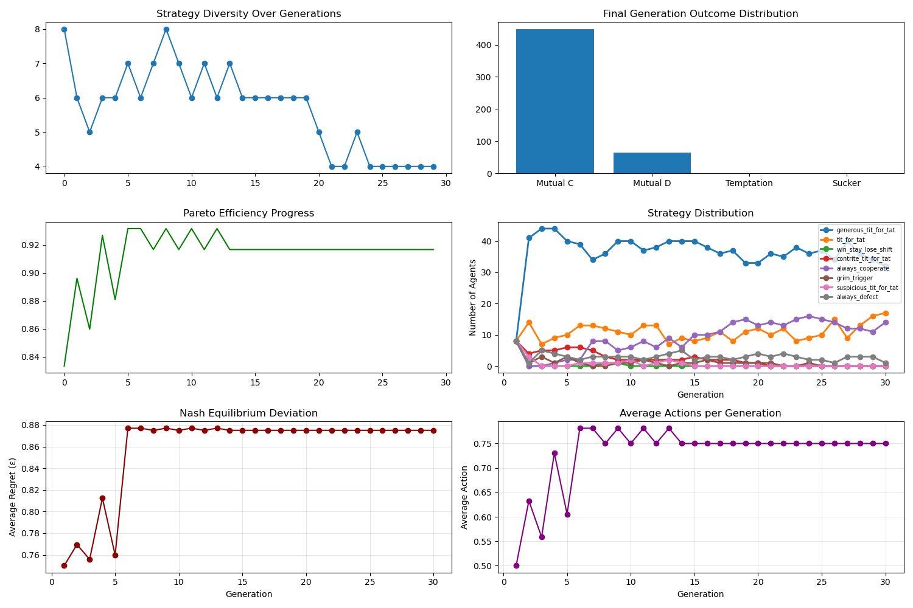

# Multi-Agent Equilibria Research Framework

## Overview

This repository contains implementations for studying strategic behaviors and emergent dynamics in multi-agent language model interactions. The framework allows researchers to investigate how language models develop non-trivial strategic behaviors in various game-theoretic scenarios.

## Prisoner's Dilemma Implementation

The `prisoner_dilemma Final.py` script provides a complete implementation of the Iterated Prisoner's Dilemma game using language models as agents. This classic game tests whether agents can develop trust and cooperation over repeated interactions.

### Features

- **LLM-Driven Decision Making**: Agents use language models to make strategic decisions
- **Multiple Strategy Support**: Includes 8 classic strategies (Tit-for-Tat, Always Defect, etc.)
- **Evolutionary Dynamics**: Top-performing strategies are selected across generations
- **Comprehensive Visualization**: Generates plots for strategy distribution, cooperation rates, and equilibrium metrics
- **Asynchronous Execution**: Optimized for performance with concurrent agent interactions

### Usage

```bash
python "Multi-Agent-Equilibria/Games/1_Prisoners_Dilemma/prisoner_dilemma Final.py"
```

You can easily modify the simulation parameters by editing the `main()` function call at the bottom of the script:

```python
main(
    num_agents=8,           # Change this to adjust number of agents
    num_generations=3,      # Change this to adjust number of generations
    model="gpt-4o-mini"     # Change this to use a different model
)
```


### Example Output

Below is an example of the type of visualizations generated by the simulation. These visualizations help in understanding the strategic dynamics and outcomes of the Iterated Prisoner's Dilemma game.




### Requirements

- Python 3.8+
- OpenAI API key (set in your environment variables)
- Required packages: openai, pandas, matplotlib, numpy, nest_asyncio

## Research Context

This implementation is part of a broader research initiative investigating multi-agent equilibria in language model interactions. The Prisoner's Dilemma serves as an example of how language models navigate social dilemmas and develop strategic behaviors.

The full research agenda includes:
- Standardized evaluation across 13 carefully selected games
- Analysis of failure modes (miscoordination, conflict, collusion)
- Investigation of emergent dynamics and equilibrium properties
- Implications for AI alignment and governance

## Getting Started

1. Clone this repository
2. Set up your OpenAI API key in a `.env` file
3. Install required dependencies
4. Run the Prisoner's Dilemma simulation
5. Explore the generated results in the `simulation_results` folder

## Contributing

Contributions to expand the framework with additional games or analysis tools are welcome. Please see our contribution guidelines for more information.

## License

This project is licensed under the MIT License - see the LICENSE file for details.
