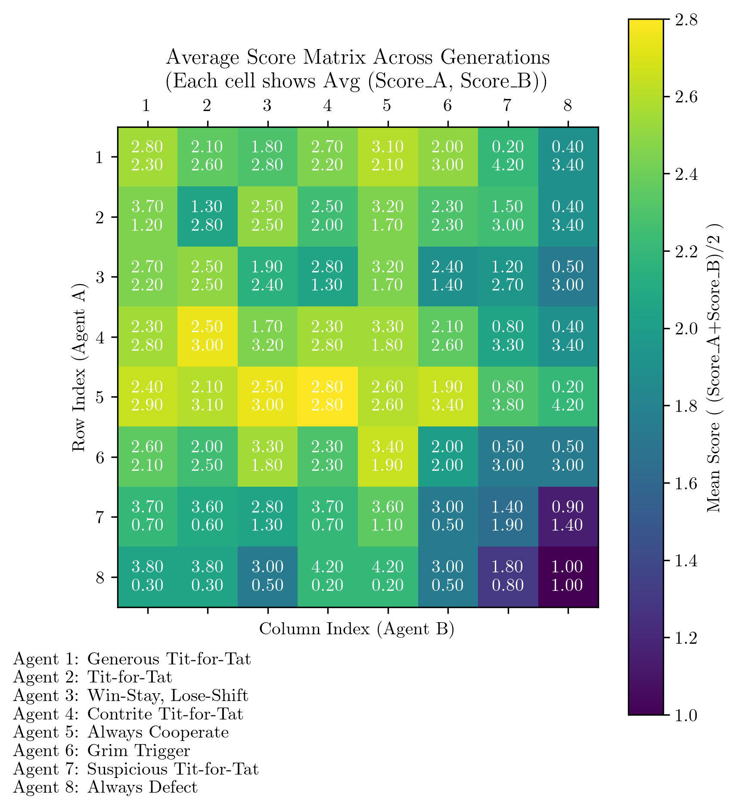
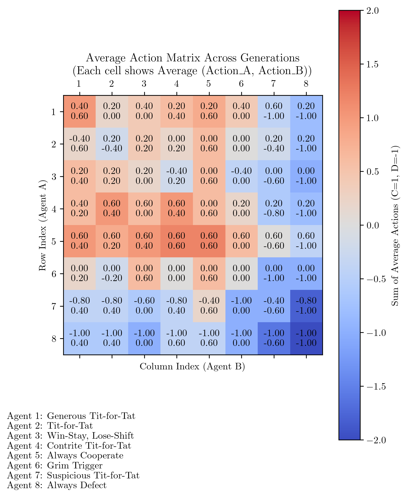
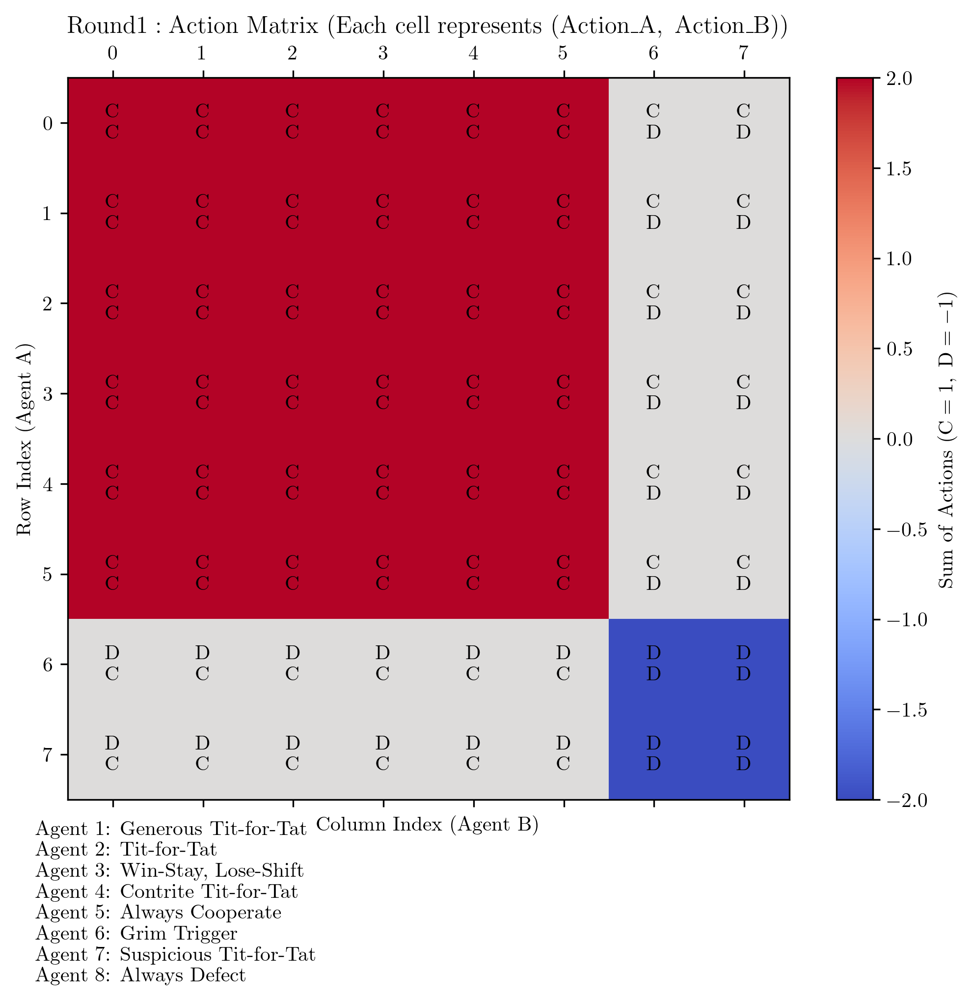

# Multi-Agent Equilibria Research Framework

## Overview

This repository investigates emergent dynamics in multi-agent language model interactions, exploring how LLMs develop non-trivial strategic behaviors in game-theoretic scenarios. The research examines how language models experience a range of unexpected outcomes when forced to collaborate or compete with peers, creating complex behavioral landscapes that both mirror and diverge from classical Nash equilibrium predictions. These findings provide essential insights into AI alignment by demonstrating how language models develop coordination mechanisms and competitive strategies that evolve dynamically over repeated interactions.

## Prisoner's Dilemma Implementation

The repository contains multiple versions of the Iterated Prisoner's Dilemma implementation:

- **`prisoner_dilemma Final.py`**: Complete implementation of the game with language models as agents
- **`prisoner_dilemma Final64.py`**: Simulates all strategies against all other strategies and plots the time evolution of outcomes
- **`prisoner_dilemma FinalPrompt2.py`**: Features selection between multiple LLM providers and different prompt templates
- **`Analysis_of_Data.ipynb`**: Jupyter notebook for analyzing and visualizing simulation outcomes after they've been run

### Features

- **LLM-Driven Decision Making**: Agents use language models to make strategic decisions
- **Multiple Strategy Support**: Includes 8 classic strategies (Tit-for-Tat, Always Defect, etc.)
- **Evolutionary Dynamics**: Top-performing strategies are selected across generations
- **Comprehensive Visualization**: Generates plots for strategy distribution, cooperation rates, and equilibrium metrics
- **Asynchronous Execution**: Optimized for performance with concurrent agent interactions

### Usage

Run any of the script versions depending on your research needs:

```bash
# Standard implementation
python "Multi-Agent-Equilibria/Games/1_Prisoners_Dilemma/prisoner_dilemma Final.py"

# All-strategies simulation with time evolution
python "Multi-Agent-Equilibria/Games/1_Prisoners_Dilemma/prisoner_dilemma Final64.py"

# Multiple LLM providers and prompt templates
python "Multi-Agent-Equilibria/Games/1_Prisoners_Dilemma/prisoner_dilemma FinalPrompt2.py"

# For analysis after running simulations
jupyter notebook "Multi-Agent-Equilibria/Games/1_Prisoners_Dilemma/Analysis_of_Data.ipynb"
```

You can easily modify the simulation parameters by editing the `main()` function call at the bottom of each script:

```python
# For prisoner_dilemma Final.py and Final64.py
main(
    num_agents=8,           # Change this to adjust number of agents
    num_generations=3,      # Change this to adjust number of generations
    model="gpt-4o-mini"     # Change this to use a different model
)

# For prisoner_dilemma FinalPrompt2.py
main(
    num_agents=8,           # Number of agents  
    num_generations=3,      # Number of generations
    llm_provider="openai",  # LLM provider: 'openai' or 'litellm'
    llm_model="gpt-4o",     # Model to use
    prompt_choice="prompts1", # Prompt template to use
    temperature=0.8         # Temperature for generation
)
```

### Example Output

Below is an example of the type of visualizations generated by the simulation. These visualizations help in understanding the strategic dynamics and outcomes of the Iterated Prisoner's Dilemma game.






## Additional Game Implementations

Beyond the Iterated Prisoner's Dilemma, the repository now includes several other LLM-driven, multi-agent games. Each game follows the same design philosophy—self-contained simulation script(s), rich logging, and built-in visualisation utilities—so they can be run and analysed independently.

| # | Game | Folder | Core Script | Brief Description |
|---|------|--------|-------------|-------------------|
| 2 | **MIT Beer Game** | `Games/2_MIT_Beer_Game` | `test.py` | Four-role supply-chain game (Retailer, Wholesaler, Distributor, Factory) that asks an LLM to generate adaptive ordering policies and tracks inventory, backlog, bullwhip and cost metrics. |
| 3 | **Fishery (Common-Pool Resource) Game** | `Games/3_Fishery_Game` | `fishery_game.py` / `enhanced_fishery_game.py` | Agents harvest from a regenerative fish stock and learn extraction levels over generations. Computes Gini coefficients, equilibrium distance and logistic growth dynamics. |
| 4 | **Market Impact Game** | `Games/4_Market_Impact_Game` | `market_impact_game.py` | Simulates algorithmic traders whose BUY/SELL/HOLD decisions move prices. Logs P&L, market depth and equilibrium metrics across rounds & generations. |
| 5 | **Oligopoly Simulation** | `Games/5_oligopoly_simulation` | `oligopoly.py` + `run_experiments.py` | Classical price-setting oligopoly with baseline, heuristic, LLM and mixed agent types; explores markup, HHI and time-to-collusion under varying N, noise and cost asymmetries. |
| 6 | **Security Dilemma Game** | `Games/6_Security_Dilemma` | `play_security_dilemma.py` | Iterated "arms-race" interaction including misperception noise, rich strategy library (TFT, Grim-trigger, Pavlov, etc.), CLI & batch modes, and JSON-schema-validated logs. |

### Common Features
* **LLM-Driven Decision Making** – All games can call OpenAI or LiteLLM models; graceful fallback if no key is present.
* **Asynchronous Execution** – Intensive simulations run with `asyncio` and/or thread pools for speed.
* **Rich Metrics & Logs** – Each game serialises JSON/CSV logs and produces Matplotlib plots (saved in a game-specific `results/` or `simulation_results/` folder).
* **Reproducibility** – Random seeds are exposed via function arguments and logged with the run metadata.

## Plotting & Code Architecture

Every game uses a *two-layer* architecture for visualising both **results** *and* **source-code structure*:

1. **Result Plots** – Dedicated helper functions (e.g., `plot_beer_game_results`, `create_fishery_plots`, `generate_visualizations`) convert CSV/JSON logs into publication-ready figures.
2. **Mermaid Flowcharts of Code** – The `Games/PlotArchitecture` package provides:
   * `architecture_flowchart.py` – A generic driver that sends any Python file to an LLM and receives a Mermaid diagram of its call-graph / class hierarchy.
   * `generate_architecture.sh` – Convenience script to regenerate flowcharts for *all* games (`./generate_architecture.sh`) or a single one (`./generate_architecture.sh 3`).
   * *Per-game* `plot_architecture.py` wrappers that live inside each game folder and call the driver with the correct file path. Flowcharts are saved under `<game>/architecture/` as `.mmd` & `.html` for quick viewing.

This separation keeps the simulation code lean while still offering up-to-date, interactive documentation of each game's internal logic.

### Requirements

- Python 3.8+
- OpenAI API key (set in your environment variables)
- Required packages: openai, pandas, matplotlib, numpy, nest_asyncio

## Research Context

This implementation is part of a broader research initiative investigating multi-agent equilibria in language model interactions. The research explores how language models navigate social dilemmas, develop strategic behaviors, and form emergent dynamics that both mirror and diverge from classical Nash equilibrium predictions.

The full research agenda includes:
- Development of standardized evaluation methodologies across multiple game types
- Analysis of interaction failure modes (miscoordination, conflict, collusion)
- Investigation of emergent dynamics and equilibrium properties
- Exploration of coordination mechanisms under information asymmetry
- Implications for AI alignment, governance, and deployment in sociotechnical environments

The findings extend beyond theoretical interest to provide essential insights for AI alignment research, suggesting that alignment efforts must account for dynamic multi-agent equilibria when multiple language models interact in shared spaces.

## Getting Started

1. Clone this repository
2. Set up your OpenAI API key in a `.env` file
3. Install required dependencies
4. Run the Prisoner's Dilemma simulation
5. Explore the generated results in the `simulation_results` folder

## Contributing

Contributions to expand the framework with additional games or analysis tools are welcome. Please see our contribution guidelines for more information.

## License

This project is licensed under the MIT License - see the LICENSE file for details.
